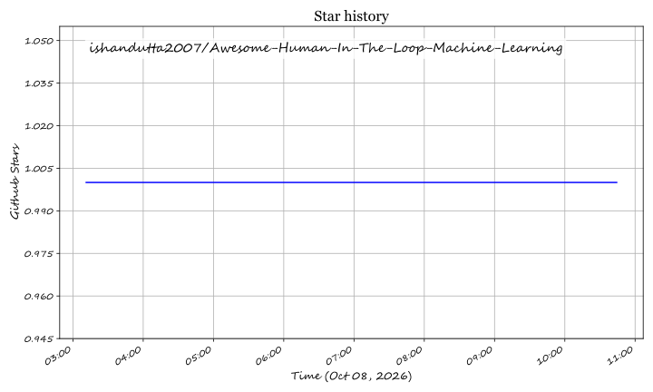

# Awesome-Human-In-The-Loop-Machine-Learning 🔄 🧠 🎯

  

  
  
  
  
  
  

---

## 🌟 Top Human-in-the-Loop Machine Learning Ecosystem

**Curated List of Commercial HITL Platforms & Open-Source Data Annotation, RLHF & Active Learning Frameworks**  

*Comprehensive directory covering Data Labeling, Active Learning, RLHF Feedback Pipelines, Model Evaluation, Expert Review Workflows & Self-Hosted HITL Systems.*

**Last updated: October 2026** 📅

---

### 📌 Overview & SEO Summary

Welcome to the ultimate curated directory of **human-in-the-loop machine learning (HITL ML) platforms**, **open-source annotation tools**, and **active learning frameworks**. As machine learning models transition into generative AI and complex reasoning tasks, human feedback via **Reinforcement Learning from Human Feedback (RLHF)**, **Direct Preference Optimization (DPO)**, and **interactive error correction** has become essential.

Whether you are seeking enterprise-grade commercial platforms (like *Amazon A2I*, *Scale AI*, and *Labelbox*) or high-performance open-source frameworks (like *Label Studio*, *CVAT*, *Cleanlab*, *Argilla*, and *small-text*), this repository provides structured insights, transparent pricing models, free-tier limits, and star rankings to help ML team leads, data scientists, and AI researchers choose the right stack.

**Key Market Insights & SEO Highlights:**
- **Enterprise Managed Review**: **Amazon A2I** integrates natively with AWS services for structured text extraction and moderation review workflows.
- **Model Evaluation & Data Curation**: **Scale AI** and **Labelbox** provide expert human-in-the-loop workflows for LLM reasoning evaluation and agent-tool interaction labeling.
- **Open-Source Multi-Modal Annotation**: **Label Studio** leads the open-source landscape with multi-modal annotation capabilities across image, text, audio, video, and time-series data.
- **Data-Centric AI & RLHF**: **Argilla** and **Cleanlab** offer specialized open-source pipelines for preference dataset curation, automated label error detection, and continuous model monitoring.

---

## 📑 Table of Contents

- [🏢 SaaS & Commercial Platforms](#-saas--commercial-platforms)
- [🔓 Open-Source GitHub Projects](#-open-source-github-projects)
- [🛠️ How to Contribute](#%EF%B8%8F-how-to-contribute)
- [📊 Star History](#-star-history)
- [🤝 Support & Sponsorship](#-support--sponsorship)
- [⚠️ Disclaimer](#%EF%B8%8F-disclaimer)

---

## 🏢 SaaS / Commercial Platforms

The global **Human-in-the-Loop Machine Learning and Data Annotation Market** is estimated at **$3.5 Billion in 2026** and is projected to reach over **$10 Billion by 2030** with a CAGR of ~28%. The sector displays **moderate fragmentation**, featuring cloud hyperscalers (*Amazon A2I*), mega-funded market leaders (*Scale AI*), specialized data annotation platforms (*Labelbox*, *SuperAnnotate*, *Encord*), and specialized domain expert workforces (*iMerit*, *CloudFactory*). While winner-take-most dynamics exist for high-volume foundation model RLHF data, domain-specific requirements (medical, 3D spatial, legal, video segmentation) maintain healthy multi-vendor competition.

*Sorted by Valuation / Market Capitalization (Descending)* 📈

| SaaS / Commercial Platform | Company / Owner | Company Size / Valuation / Market Cap | Standard Edition Starting Price | Free Tier / Free Trial Limits | Description |
| :--- | :--- | :--- | :--- | :--- | :--- |
| **[Amazon Augmented AI (A2I)](https://aws.amazon.com/augmented-ai/)** ☁️ | Amazon | ~$2.0 Trillion (Public) | **$0.02 / reviewed object** (Rekognition/Textract), $0.02 - $0.08 / custom task | **500 free human reviews** (First 12 months) + $200 AWS credit | **AWS-native human review** — **Managed workflows for human review of ML predictions** . **Built-in workflows for content moderation and text extraction**. **Integrates with Rekognition, Textract, and SageMaker**. **Three workforce options**: Mechanical Turk, AWS Marketplace vendors, or your own employees. |
| **[Scale AI](https://scale.com/)** 🎯 | Scale AI | ~$14 Billion (Private) | **$0.05 / self-serve unit**; Managed enterprise custom quotes | **200 free units/month** (Self-serve) / 14-day trial ($10 credit for Voice) | **Data labeling and model evaluation** — **Human-in-the-loop for expert-level reasoning data** . **Autoraters with model debate** detect **4x more incorrect answers** (23% to 82%) . **Used by OpenAI, Meta, and Microsoft**. |
| **[Appen](https://www.appen.com/)** 🟡 | Appen | ~$500 Million (Public) | **Contact sales** (Custom project & managed workforce quotes) | **Demo / Sample pilot by request** (No self-serve free tier) | **AI data services** — **1M+ vetted contributors across 500+ locales** . **30 years of AI data expertise**. |
| **[Labelbox](https://labelbox.com/)** 🏢 | Labelbox | Private ($1B+ Valuation) | **Contact sales** for custom enterprise tiers | **500 free LBU credits/month** (Up to 30 users, 25 ontologies) | **Data labeling platform** — **Annotate, Model, and Foundry** . **MCP support for agent-tool interaction labeling** . **Model-assisted labeling with LLMs**. |
| **[SuperAnnotate](https://www.superannotate.com/)** 🔵 | SuperAnnotate | Private (~$250M Valuation) | **Contact sales** (Starter / Enterprise custom quotes) | **Demo / Pilot trial by request** (No public self-serve free plan) | **AI data platform** — **Agent Hub for human-in-the-loop workflows** . **Reduces labeling time by up to 80%**. **Part of NVIDIA Enterprise AI Factory** for on-prem deployment . |
| **[Encord](https://encord.com/)** 🟣 | Encord | Private (~$200M Valuation) | **Contact sales** (Starter, Team & Enterprise custom quotes) | **14-day managed trial / demo by request** (No public free tier) | **Applied AI platform** — **Annotation for production AI** . **Human-in-the-loop workflows with multi-stage review**. **Active learning and model evaluation**. **SAM 2 for 10x faster segmentation**. |
| **[CloudFactory](https://www.cloudfactory.com/)** 🟠 | CloudFactory | Private (~$200M Valuation) | **Contact sales** (Consumption / Flex Pass custom team quotes) | **Free project analysis & sample dataset test** (No self-serve trial) | **AI data platform** — **Human safety net for low-confidence predictions** . **Cut inspection times by 66%** for heavy equipment rental . **SOC2, HIPAA, and GDPR compliant**. |
| **[Dataloop](https://dataloop.ai/)** 🟢 | Dataloop | Private (~$150M Valuation) | **Contact sales** (Consumption-based enterprise quotes) | **Custom pilot trial by request** (No public self-serve free tier) | **AI development platform** — **Active learning orchestrator with human feedback** . **Pipeline nodes for model training, evaluation, and comparison**. **SOC 2 and GDPR compliant**. |
| **[iMerit](https://imerit.net/)** 🟤 | iMerit | Private (~$100M Valuation) | **Contact sales** (Managed domain expert custom quotes) | **Demo & sample pilot trial by request** (No self-serve free tier) | **Domain expert services** — **5,000+ full-time employees with domain expertise** . **RLHF and model evaluation**. **Ango Hub for AI-assisted workflows**. |
| **[Kili Technology](https://kili-technology.com/)** 🔴 | Kili Technology | Private (~$50M Valuation) | **$0 / month** (Free tier), Grow/Enterprise quotes | **200 assets & 2 seats free forever** + 14-day full feature trial | **Expert-in-the-loop platform** — **Structured review process with author tracking** . **Golden dataset creation and model evaluation**. **SaaS or on-prem deployment**. |

---

## 🔓 Open-Source GitHub Projects

*Sorted by GitHub Stars_Count (Descending)* 🌟

- **[Label Studio](https://github.com/HumanSignal/label-studio)**   
  **Multi-modal data annotation platform**, Apache-2.0 licensed. **28K+ GitHub_Stars** — **the most widely deployed open-source annotation platform** . **Supports image, video, text, audio, and time-series data** . **Active learning and model pre-annotation backends** . **ML backend integration for predictions** . **The definitive open-source human-in-the-loop annotation platform** . 🏷️ ⚡

- **[Labelme](https://github.com/wkentaro/labelme)**   
  **Graphical image annotation tool inspired by LabelMe**, GPL-3.0 licensed. **16K+ GitHub_Stars** — **the classic lightweight polygon annotation tool for computer vision** . **Supports polygon, rectangle, circle, line, and point labeling** . **JSON format exports for instant ML dataset preparation** . 🖼️ 🎨

- **[CVAT (Computer Vision Annotation Tool)](https://github.com/cvat-ai/cvat)**   
  **Powerful open-source computer vision annotation tool**, MIT licensed. **14K+ GitHub_Stars** — **the industry standard for high-speed video and image labeling** . **Automatic object tracking, semi-automatic segmentation with SAM**, and **collaborative multi-user workflows** . 📹 🚘

- **[Cleanlab](https://github.com/cleanlab/cleanlab)**   
  **Data-centric AI for data quality and label errors**, Python licensed. **11K+ GitHub_Stars** — **the standard for automated data quality improvement and label noise detection** . **Finds incorrect annotations, out-of-distribution data, and ambiguous samples** in text, tabular, and vision datasets . 🧹 🔍

- **[doccano](https://github.com/doccano/doccano)**   
  **Open-source text annotation tool for human annotators**, MIT licensed. **11K+ GitHub_Stars** — **lightweight web-based annotation for NLP** . **Supports Named Entity Recognition (NER), Sentiment Analysis, Text Classification, and Sequence-to-Sequence tasks** . 📝 💬

- **[X-AnyLabeling](https://github.com/CVHub520/X-AnyLabeling)**   
  **Auto-labeling tool with Segment Anything (SAM) and YOLO integration**, GPL-3.0 licensed. **10K+ GitHub_Stars** — **AI-assisted auto-annotation desktop application** . **Integrates SOTA AI models for instant box, mask, and keypoint generation** . 🚀 🤖

- **[Argilla](https://github.com/argilla-io/argilla)**   
  **Human and AI feedback platform**, Apache-2.0 licensed. **5K+ GitHub_Stars** — **the premier open-source platform for collecting human feedback and RLHF** . **Preference rankings (pairwise/multi-option) for LLM fine-tuning**, **data curation, and continuous monitoring** . **Seamless Hugging Face ecosystem integration** . 🤗 ⚖️

- **[LabelLLM](https://github.com/OpenDataLab/LabelLLM)**   
  **Open-source data annotation platform for LLM development**, Apache-2.0 licensed. **Optimizes annotation for large language model instruction tuning** . **Multimodal data support**: text, audio, images, video . **AI-assisted pre-annotation and quality oversight** . 🦙 🗣️

- **[small-text](https://github.com/webis-de/small-text)**   
  **Active learning for text classification in Python**, MIT licensed. **Pool-based active learning for single- and multi-label text classification** . **State-of-the-art query strategies including GPU-accelerated methods** . **Integrates scikit-learn, PyTorch, and Hugging Face transformers** . 🎯 📊

- **[Scalabel](https://github.com/scalabel/scalabel)**   
  **Versatile and scalable annotation platform for 2D/3D data**, Apache-2.0 licensed. **Supports 2D images, video tracking, and 3D point cloud LiDAR labeling** . **Used to annotate BDD100K** . **Real-time multi-user collaboration** . 🚗 🌐

- **[Orchestra](https://github.com/b12io/orchestra)**   
  **Human-in-the-loop AI system for orchestrating expert teams**, Python licensed. **660+ GitHub_Stars** . **Orchestrates project workflows across human experts and machine algorithms** . 🎼 👥

- **[Tornado](https://github.com/slrbl/human-in-the-loop-machine-learning-tool-tornado)**   
  **Interactive Human-in-the-loop ML tool**, MIT licensed. **Label your dataset on the fly while training your model** through a clean web UI . **Supports structured tabular, text, and image data** . 🌪️ 💻

- **[RootPainter](https://github.com/Abe404/root_painter)**   
  **Deep learning segmentation with corrective human annotation**, BSD-3-Clause licensed. **Deep Learning Segmentation of Biological Images** with interactive human feedback . 🔬 🌱

- **[active-vision](https://github.com/dnth/active-vision)**   
  **Active learning loop framework for computer vision**, MIT licensed. **Image classification, object detection, and segmentation active learning** . **Uncertainty sampling with Gradio interactive UI** . 👁️ 🖥️

- **[Argilla Quickstart Sandbox](https://github.com/argilla-io/argilla)**   
  **Set up Argilla locally to collect pairwise preference rankings in under 5 minutes**, Apache-2.0 licensed. **The fastest path to starting RLHF feedback collection** . 🚀 ⏱️

---

## 🛠️ How to Contribute

Contributions are welcome! Follow these steps to submit new HITL platforms or open-source annotation software:

1. 🍴 **Fork** the repository.
2. 📝 **Add/edit** entries in `README.md` maintaining table/list structure, Stars_Badge links, and formatting.
3. 🔗 Include project title, official website/GitHub link, exact Stars_Count badge, license, and brief description.
4. 🚀 Submit a **Pull Request** with a descriptive summary of your changes.

---

## 📊 Star History

---

## 🤝 Support & Sponsorship

If you find this human-in-the-loop machine learning repository useful, please consider supporting the project:

- ⭐ **Star** this repository to increase visibility and help other ML engineers discover HITL tools!
- 🔀 **Fork** and share with fellow ML researchers, data engineers, and AI practitioners.
- ☕ **Sponsor & Buy Me a Coffee**: Support ongoing open-source curation and maintenance via the [GitHub Sponsor Dashboard](https://github.com/sponsors/ishandutta2007).

---

## ⚠️ Disclaimer

- This is a **community-curated directory** — not exhaustive and not an official endorsement of listed software. ℹ️
- **Amazon A2I provides managed human review workflows** with **per-task pricing and no upfront costs** . **Scale AI uses model debate with LLMs** to detect **4x more incorrect answers** . **SuperAnnotate Agent Hub reduces labeling time by up to 80%** .
- **Label Studio is the leading open-source annotation platform** with **28K+ GitHub_Stars** . **CVAT is the premier tool for video object tracking** . **Argilla is the standard for open-source RLHF human feedback collection** .
- **Open-source HITL tools require infrastructure deployment** — including backend databases (e.g., PostgreSQL, Redis, or Elasticsearch) and active learning server setups . **Always conduct a proof-of-concept (PoC) validation** for data security, annotation throughput, and model evaluation quality before deploying in production . 🔄

---

  <b>Made with ❤️ for ML engineers, data scientists, and open-source human-in-the-loop advocates.</b>

## ⭐ Star History

<a href="https://star-history.com/#ishandutta2007/Awesome-Human-In-The-Loop-Machine-Learning&Timeline" align="center">
  <picture>
    <source media="(prefers-color-scheme: dark)" srcset="assets/ishandutta2007_Awesome-Human-In-The-Loop-Machine-Learning_growth.svg">
    
  </picture>
</a>
